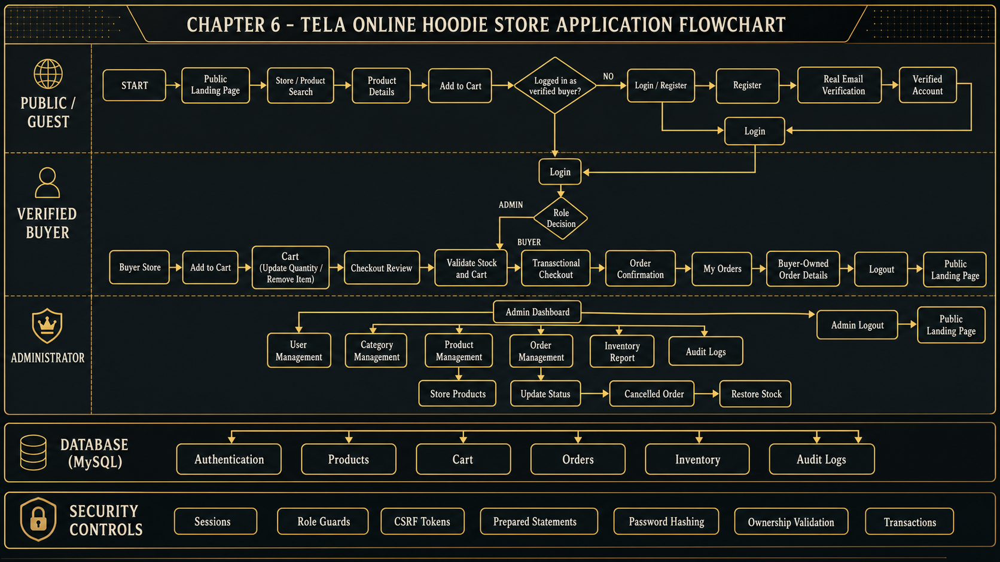

# TELA Online Hoodie Store

<p align="center">
  
</p>

TELA, or Technology Enhanced Lifestyle Apparel, is a complete online Hoodie store developed as a college final project for CCS0043 - Applications Development and Emerging Technologies.

The application provides a public storefront, verified buyer accounts, shopping cart and checkout workflows, buyer order history, and protected administrator management tools. It is intentionally built with procedural PHP and beginner-friendly code so every module can be explained during project defense.

## Live Website

[https://tela.kcykae.dev/](https://tela.kcykae.dev/)

## Product Scope

TELA sells one apparel product only:

- Hoodies

`Hoodies` is the sole product category. Inactive products are hidden from the public Store, while products with zero stock remain visible with an Out of Stock state.

## Technology Stack

- PHP 8+ using procedural PHP
- MySQL or MariaDB
- MySQLi prepared statements
- Bootstrap 5
- HTML5 and CSS3
- Vanilla JavaScript
- Apache
- XAMPP for local development
- DigitalOcean Ubuntu Droplet for production
- Brevo Transactional Email REST API through native PHP cURL

No PHP framework, MVC framework, Composer package, Node.js application, or JavaScript frontend framework is used.

## Main Features

### Public and Buyer Features

- Public landing page, About page, Store, and Product Details
- Active Hoodie product listing and product-name search
- Safe product-image fallback handling
- Buyer registration with client-side and server-side validation
- Secure password hashing using `password_hash()`
- Real verification-email delivery through Brevo
- Verification-token expiration and resend throttling
- Verified-account login and secure session handling
- Buyer-only shopping cart
- Add, update quantity, and remove cart items
- Current-price, stock, subtotal, and total validation
- Transactional checkout and simulated payment selection
- Order creation with order-item snapshots
- Stock deduction during successful checkout
- Buyer-owned order history and order details

### Administrator Features

- Protected administrator dashboard and navigation
- Operational summaries for users, products, stock, and orders
- Administrator account listing, creation, and editing
- Category listing, creation, editing, duplicate prevention, and safe deletion
- Product listing, creation, editing, image upload, status management, and safe deletion or deactivation
- Price and stock management with audit records
- Order listing, order details, and controlled status updates
- Transactional stock restoration when an order is cancelled
- Inventory report with stock and status summaries
- Audit-log report with user and activity information

## Security Controls

- Password hashing and verification
- PHP sessions with secure cookie settings
- Session ID regeneration after login
- Guest, buyer, and administrator role guards
- Verified-account enforcement
- Native session-based CSRF tokens
- MySQLi prepared statements
- Server-side validation and escaped output
- Buyer ownership validation for carts and orders
- Transactional checkout and cancellation handling
- Product upload extension, MIME, image-content, and 2 MB size validation
- Generated upload filenames for application uploads
- Script execution blocked inside the product upload directory
- Generic browser-facing database errors
- Production errors hidden from browser output
- API keys and production credentials kept outside Git

## Database

Database name: `tela_db`

The schema contains seven related tables:

- `users`
- `categories`
- `products`
- `cart`
- `orders`
- `order_items`
- `audit_logs`

The main schema is in [`database/tela_schema.sql`](database/tela_schema.sql).

The optional [`database/reset_and_seed.sql`](database/reset_and_seed.sql) file clears existing application records and loads the finalized development accounts, sole Hoodie category, and ten TELA Hoodie products. It is destructive and must not be run against important data without a backup.

## Application Flowchart



## Project Structure

```text
TELA/
|-- admin/          Administrator dashboard and management pages
|-- assets/         Shared CSS, JavaScript, logos, and visual assets
|-- auth/           Registration, verification, login, and logout
|-- buyer/          Store, cart, checkout, payment, and buyer orders
|-- config/         Shared application and database configuration
|-- database/       Schema and reset/seed SQL scripts
|-- docs/           Project documentation assets
|-- documentation/  Final documentation images and diagrams
|-- includes/       Shared layout, helpers, guards, and email helper
|-- scripts/        CLI-only maintenance utilities
|-- uploads/        Uploaded product images
|-- index.php       Public landing page
`-- README.md
```

## Local Installation

### Requirements

- XAMPP with Apache, PHP 8+, and MySQL
- PHP `mysqli` and `curl` extensions
- A Brevo account and verified sender for real verification email

### Setup

1. Place the project at `C:\xampp\htdocs\TELA`.
2. Start Apache and MySQL from XAMPP.
3. Import `database/tela_schema.sql` through phpMyAdmin.
4. Copy `config/config.example.php` to `config/config.local.php`.
5. Add the local database, Brevo, and application URL values to `config.local.php`.
6. Confirm that `uploads/products/` exists and is writable.
7. Open [http://localhost/TELA/](http://localhost/TELA/).

Example local URL values:

```php
define('APP_ENV', 'development');
define('APP_BASE_URL', 'http://localhost/TELA');
define('BASE_URL', '/TELA/');
```

Never commit `config/config.local.php`.

## Production Configuration

The production website is hosted from the root of the TELA subdomain. Its URL configuration must therefore be:

```php
define('APP_ENV', 'production');
define('APP_BASE_URL', 'https://tela.kcykae.dev');
define('BASE_URL', '/');
```

TELA can also read these server environment variables:

```text
TELA_APP_ENV
TELA_DB_HOST
TELA_DB_USER
TELA_DB_PASSWORD
TELA_DB_NAME
TELA_APP_BASE_URL
TELA_BASE_URL
```

Production database credentials and Brevo credentials must remain in the ignored private configuration or protected server environment. They must never be placed in this README or committed to GitHub.

## Product Images

Administrator uploads support:

- JPG and JPEG
- PNG
- WebP
- Maximum size of 2 MB

Images are stored under `uploads/products/`, while the database stores only their relative paths.

For the prepared ten-image development set, the CLI-only assignment utility can randomly bind the supplied images to the existing ten Hoodie products:

```bash
php scripts/assign_product_images.php
```

The utility validates every image and aborts without changing the database unless the valid image count matches the current Hoodie product count.

## Team

### Kyl Aldric Valencia

Project Lead, Full-Stack Developer, and System Architect

Led the system planning, architecture, implementation, security, integration, debugging, documentation, UI refinement, and deployment preparation.

### Emran Ryan Maina

Backend Developer and Database Developer

Assisted with backend modules, reusable PHP functions, SQL queries, database integration, CRUD operations, validation, and backend testing.

### Jerahmeel Romero

Frontend and Product Module Developer

Assisted with frontend pages, product and category interfaces, backend integration, responsive layouts, UI consistency, and form validation.

### Xander David Canlas

Quality Assurance and Integration Developer

Assisted with module integration, database verification, Buyer and Admin workflow testing, security testing, issue identification, and final regression testing.

## Known Limitations

- TELA sells Hoodies only.
- Payments are classroom simulations; no real payment processor is connected.
- Buyers cannot cancel orders directly.
- Delivery tracking is outside the project scope.
- Checkout does not store a separate historical delivery-address snapshot.
- Report exporting and advanced analytics are outside the project scope.

## Educational Disclaimer

TELA was created for educational purposes as a college final project. It does not process real payments or provide commercial shipping and delivery tracking.
